# Market Research & Financial Analysis: ROKU
---

## Background

Since my last [analysis](https://github.com/danalain/Security_Analysis) of the ten top-performing stocks that IPO'd in 2017, I have created my portfolio using a majority of those stocks on [Robinhood](https://robinhood.com/). Within three months, it has performed relatively well considering the chaotic political climate and the uncertainty from the ongoing pandemic. It produced an ROI of 21.36% in contrast to the NASDAQ index with 13.3% ROI and S&P 500 index with a 6.1% ROI respectively from November 24, 2020, to January 25, 2021.

After developing some skin in the game, I must get serious about my analysis of the companies that I have invested money in. Recently, I witnessed a surge in stock prices of ROKU Inc ([ROKU](https://www.finviz.com/quote.ashx?t=ROKU)). As a naturally curious individual, I am going to conduct a detailed analysis of Roku and come up with a few investment strategies. So, let's get started!

This project will focus on three main tasks:

1. [Company Profile](#Company-Profile): Detailed market research analysis of the company business model and growth opportunities.
2. [Sentiment Analysis](#Sentiment-Analysis): Visualizations of two sentiment analysis methods.
3. [Investment Strategies](#Investment-Strategies): Short-term trading strategy, Valuation and long term investment of Roku stocks.

---
### Company Profile

#### 1. Story

Welcome to the streaming wars! As the pandemic has put many people inside their homes, most people have replaced outdoor leisure activities with in-home entertainment. As people are watching more content at home, many streaming services are competing to gain customers by investing billions of dollars in content creation. For instance, Netflix, Amazon, Disney+, HBO Max are amongst the prime competitors in the streaming business.

This is where Roku comes into the picture. Without participating in the streaming war, Roku provides a platform for these competing streaming services to reach general audiences at a wider scale. Recently, there has also been a shift from traditional cable to Streaming TV Platforms due to a better selection of quality content with a lower price.

Furthermore, Roku TV’s competitive edge in gaining customers is its affordable hardware prices that provide better acquisition results compared to other streaming TV devices. However, as Roku players compete with streaming devices from Google, Amazon, and Apple, one might wonder how can it possibly make money just by selling low price hardware and hosting streaming channels.

#### 2. Business Model

Roku's business model is unique in the popular streaming business. Although it sells hardware and players, Roku is not in the player business but the advertising business as it charges a portion of its affiliates' ad-revenues. Therefore, a detailed look at Roku's 5Ps as follows can provide a better understanding of its business model and its market.

#### People

As the majority of the population are staying at home during this ongoing pandemic, Roku's products and services have increased their relevance especially among the youths between 18 to 34-year-old. According to [Roku Q1 2020 Shareholder Letter](https://www.sec.gov/Archives/edgar/data/0001428439/000156459020022846/roku-ex991_6.htm), "primetime linear viewing among adults 18-34 from March 16 to April 19 was down 18% year-over-year, and nearly half of TV viewing by this important demographic was streamed." With its affordable pricing, Roku also attracts the majority of viewers from low to medium income households. As the products are getting a more polished look over the years, Roku has become one step closer to their focused mission of powering every TV in the world.  

#### Product 

Roku has two main categories of product consisting of their player products, and the platform itself. The player category comprises three product segments which include streaming player devices, audio solution devices, and the Roku TV products. The player market is a strategic front to solidify Roku's market share with its affordable pricing strategy. The following figures include hyperlinks to view the devices in each category. 

| [Explore Players](https://www.roku.com/products/players) | [Explore Audio Solutions](https://www.roku.com/products/audio/) |
| -------------------------------------------------------- | --------------------------------------------------------------- |
| [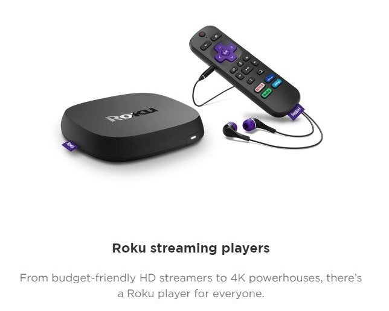](https://www.roku.com/products/players) | [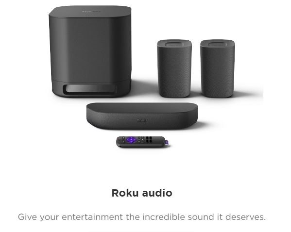](https://www.roku.com/products/audio/) |

| [Explore Roku TV](https://www.roku.com/en-gb/products/roku-tv) |
| ------------------------------------------------------------------- |
| [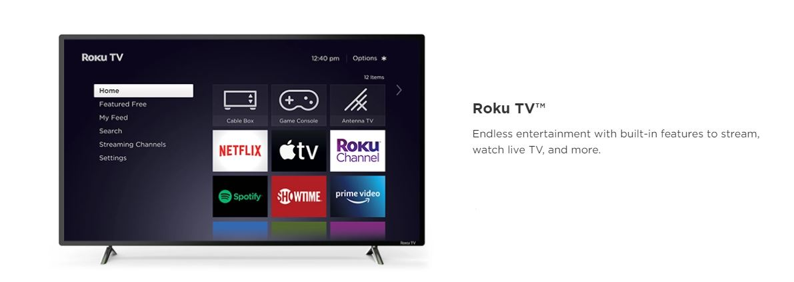](https://www.roku.com/en-gb/products/roku-tv) |

After a successful user acquisition, Roku provides the users with a quality platform that hosts a variety of streaming services that Roku has partnered with including Netflix, Disney+, Apple TV, Amazon Prime TV, Hulu, and Spotify, etc. The platform includes three on-demand streaming models which include Subscription Video-On-Demand (SVOD), Transactional Video-On-Demand (TVOD), and Advertising Video-On-Demand (AVOD). 

Subscription VOD is a service in which it delivers an unlimited amount of content for consumers with a recurring payment. Transactional VOD is a service that sells a selected content for a one-time payment. Advertising VOD is a service that delivers content that includes advertisements. Since the start of the global pandemic, Roku's AVOD side has taken a hit as most companies reduced their advertising budget. The shareholder letter reassured that the decrease in AVOD ad-revenue was offset by ad-spend that has moved from traditional TV budgets. Meanwhile, SVOD and TVOD are pulling in more revenue. Now, let's get into detail about how each of these products is priced and how much each product makes.

#### Price

Roku Inc brings over 90% of gross profits from its Platform business. However, user acquisition is as equally as important as the ad-business on the platform, because it increases Roku's leverage to demand higher ad-revenue percentages from streaming partners on its devices as Roku owns a substantial amount of user base who are using Roku devices. The nine-month ended gross profit of the platform service and the players are given in the [Form 10-Q for the Quarterly Period ended September 30, 2020](https://www.sec.gov/ix?doc=/Archives/edgar/data/1428439/000156459020051937/roku-10q_20200930.htm#CONDENSED_CONSOLIDATED_STATEMENTS_OPERAT) as follows. 

|              |                        |                        |
| ------------ | ---------------------- | ---------------------- |
|              | __September 30, 2020__ | __September 30, 2019__ |
| __Platform__ | \$463,737,000          | \$315,738,000          |
| __Player__   | \$39,024,000           | \$17,839,000           |   

|                                                       |                                                       |
|------------------------------------------------------ | ----------------------------------------------------- |
| 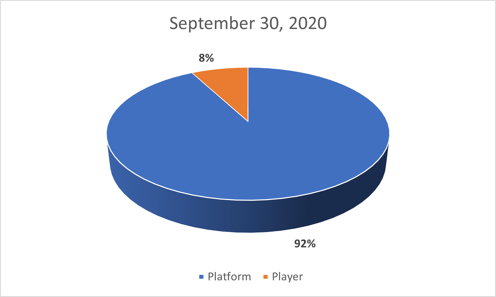 | 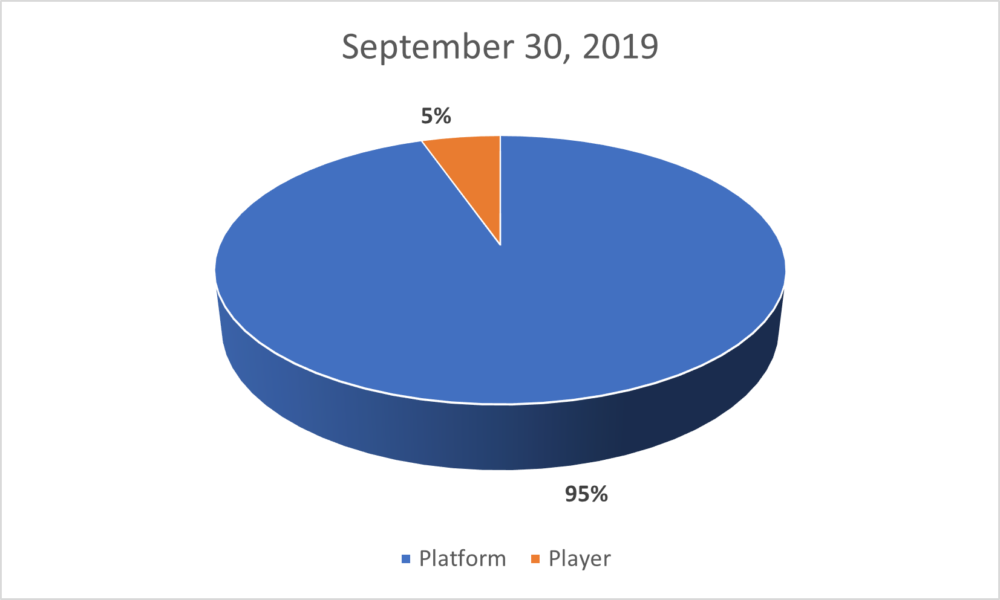 |

Prices for basic streaming devices start as cheaply as \$24.99 and ranges to \$179.99. Prices of audio solutions such as soundbars range from \$129.99 to \$199.99 and act more as an add-on to the basic streaming devices in which the majority of the first time buyers may not venture. Roku TV, on the other hand, partners with TV producers such as Magnavox, TCL, Westinghouse, Philips, JVC, Hisense and so and pre-includes Roku TV as a primary streaming platform. The prices of 32" TV ranges from \$115.00 to \$149.99.

There are two competitive edges that Roku possesses in regards to pricing. According to Roku's former CFO Steve Louden, the low price of its streaming devices was enabled by the [structural advantage](https://www.nexttv.com/features/rokus-structural-advantage-its-cheaper) of using low powered chips that run on tight memory footprint. In contrast, Apple TV or other streaming services use high power chips by leveraging their own Operating Systems. The second competitive edge is that its neutrality and low prices enable its partnership with the biggest retailers such as Walmart. You may not see Amazon streaming devices on Walmart shelves as the two companies are competitors in retail.

|  Price Comparison Among Popular Streaming TV devices |
| ---------------------------------------------------- |
| 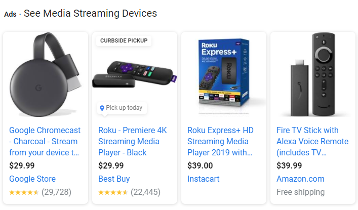   |

With such partnership and pricing, Roku has accumulated 46 million active accounts by September 30, 2020. Other streaming services engaging in the streaming war needs Roku to access wider audiences. Roku also has a [distribution agreement](https://docs.roku.com/published/developerdistribution/en/us) with its streaming partners where it conducts an inventory split of 30-70 with 30% ad-inventory going to Roku. If the channels are elected as Roku Sales Representative Program as laid out in section 4.3a of the agreement, Roku will represent 100% of the advertising inventory and pay the partner 60% of the Net Advertising Revenue. With a high percentage cut of ad-revenues, one could wonder the true power that leverage delivers. 

#### Place

Roku generates sales heavily in the United States with major retail distribution channels such as Walmart, Costco, Target, BestBuy, and online retailers such as Amazon. Roku's primary international markets include Canada, the United Kingdom, France, the Republic of Ireland, Mexico, Brazil. It is in the process of expanding its Latin American market. Roku also hinted an expansion to China when the U.S-China trade relationship eases with the change in the new administration in the White House. However, the international revenue represented less than 10% in the 3rd quarter report of 2020. It also provides exclusive products to partnering retailers for a better product differentiation among the retailers as follows.

|                                            |
| ------------------------------------------ |
| 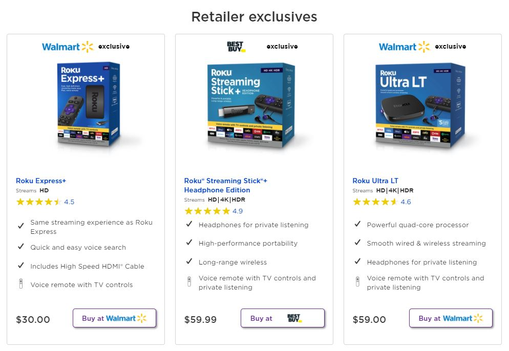 |

#### Promotion

Roku has occasional promotions on their players and TV sets. Roku also offers trial-based free entertainment and their [special offers](https://www.roku.com/en-gb/offers) are posted on its websites. Due to occasional changes, the offer may be different from time to time. Most promotions are not the most special in the streaming industry but some trial-based promotions that extend past 1 month are highly attractive, and it may bring more customers to Roku.

#### 3. Growth Opportunities

In the first month of 2021, Roku has around 50 billion dollar market capitalization. Roku [reported a 55% increase](https://blog.roku.com/en-gb/50-million#!#) inactive accounts from 32.3 million in 2019 to over 50 million in the start of 2020. In 2019, Roku also acquired a programmatic marketing software provider, Dataxu. It enhances Roku's ability to advertise more effectively to the viewers. Data is becoming the most valuable asset for every company and Roku can leverage its data from the 50 million+ active accounts to increase advertising revenues in the future. 

Currently, Roku is already providing the channels on its platform with a variety of data analytic resources. For example, its [channel engagement report](https://developer.roku.com/en-gb/docs/features/analytics/channel-engagement.md) provides information on how many hours of content the viewers of that channel is watching and [video statistic report](https://developer.roku.com/en-gb/docs/features/analytics/video-statistics.md) shows which type of content the viewers watch the most. Hence, the content providers can use this information to create a better content library for their audiences. With these attractive features, Roku can grow its channel partnership substantially in the future. With more channels, Roku is also in the best position to attract more customers in the foreseeable future.   

---
### Sentiment Analysis

Sentiment Analysis is an effective method to gain insight into how the general population might be feeling about Roku. It is essentially a vibe-check. Depending on which platform is used, the vibes may be different. Hence, using more than one method can provide better insights. First is requesting news using News API. The second is website scrapping headlines using [Finviz.com](https://www.finviz.com/).

##### Files

1. [News API +600 Headlines](Codes/sentiment_analysis_newsapi.ipynb)
2. [News API Timeline](Codes/sentiment_analysis_newsapi_date.ipynb)
3. [FinViz Website Scrapping](Codes/sentiment_analysis_finviz.ipynb)
4. [Sentiment Visualizations](Codes/sentiment_visualization.ipynb)

#### 1. News API

News API provides free requests of one month old data with limitation on the amount of articles. First, I analyzed the sentiment of more than 600 article headlines and visualized the percent of positive, negative, and neutral sentiments. Secondly, I requested at most 20 headlines each day for dating back a month and calculated the average sentiment scores to graph a linear timeline to visualize when the articles contained more or less positive headlines. 

| Percent Total by Sentiment for +600 Roku Related News API Headlines |
| ------------------------------------------------------------------- |
|                 | 

| One Month Linear Timeline of Roku News API Headlines within Dec-2020 to Jan-2021|
| ------------------------------------------------------------------------------- |
| 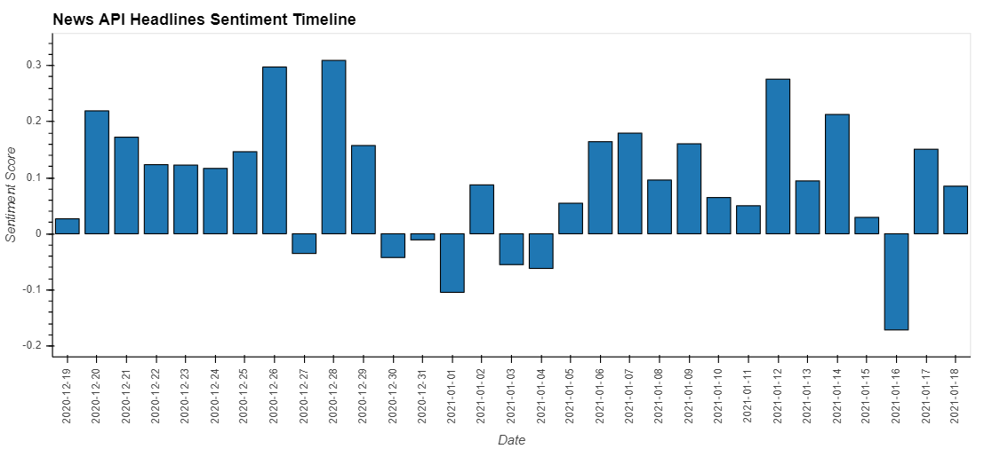                          |

To analyze the linear sentiment over the month, I used the bar plot as shown above. In both visuals, the general news headlines about Roku are positive. Even though the following may be subjected to confirmation bias, there might be a possible correlation between the dip in positive sentiment news headlines at the end of 2020 with the decrease in Roku's stock prices around the same time.

| Price Dip at the End of 2020 til Jan-04, 2021 |
| --------------------------------------------- |
| 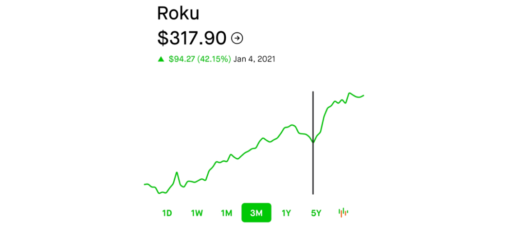 | 

#### 2. FinViz

Finviz provides the visitor of its website with information on stock prices and news headlines related to each stock. As a financial information website, the articles on its websites are mostly stock market related and also include the most relevant articles on the current news of Roku that average investors can view to make a buy/sell decision.      

| Over 1-Month Linear Timeline of [Roku Headlines on FinViz](https://www.finviz.com/quote.ashx?t=roku) |
| ---------------------------------------------------------------------------------------------------- |
| 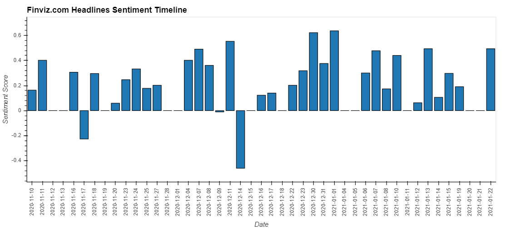                                                |

Confirmation bias may as well be the reason why using multiple sources for sentiment analysis is important. The chart shows a major consistency in positive sentiment for article headlines shown on the Roku section of the Website. However, it does not include article headlines that favor negative sentiment at the last week of 2020 where there was a slight dip in its stock prices. Even though it does not represent the entirety of the sentiment, the general sentiment of Roku in January 2021 leans largely towards positive. 

---
### Investment Strategies

When investing in a company, investors usually take two paths depending on their evaluation of the company. Investors who think the company stock prices are overvalued may go short while others who sees a potential growth in value may hold the stocks for the long term. In this section, I will analyze a short term trading strategy that may provide a potential profit by taking advantage of short term fall in stock prices. For the long term investing strategy, I will value the company by taking into account the potential growth that I find suitable for Roku.

##### Files

1. [Code for DMAC Strategy](Codes/Investment_strategy.ipynb)
2. [Valuation Spreadsheet](Spreadsheet/valuation.xlsx)

#### 1. Dual Moving Average Crossover Trading Strategy

Dual Moving Average Crossover (DMAC) Trading Strategy is a short term trading strategy where the investor waits for the 50 Day Simple Moving Average (SMA50) to intersect with the 100 Day Simple Moving Average (SMA100) to decide on the entry to and exit from the market. When the SMA50 is above the SMA100, it represents a possible bullish market. In contrast, when SMA50 is below the SMA100, it represents a possible bearish market. Therefore, the direction of stock prices can be speculated to increase or decrease as the two moving averages intersect with each other.

For example, when the SMA50 crosses the SMA100 from above and goes below, then it is reasonable to speculate a price decrease. However, the uncertainty of price swings may sometimes act against the wishes of the investor. To decrease uncertainty many traders incorporate multiple strategies such as price to moving average strategy and candlestick pattern recognition strategy in addition to the DMAC trading strategy. For simplicity, let's use Roku's historic stock prices to examine the profitability if a trader only uses the DMAC trading strategy.

| Dual Moving Average Crossover Trading Strategy |
| ---------------------------------------------- |
| 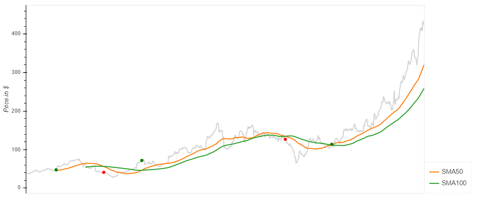  |

| Entry Date | Exit Date  | Shares | Entry Share Price | Exit Share Price | Entry Portfolio Holding | Exit Portfolio Holding| Profit/Loss|
| ---------- | ---------- | ------ | ----------------- | ---------------- | ----------------------- | --------------------- | ---------- |
| 08/07/2018 | 11/29/2018 | 150    | 47.42             | 40.84            | 7113                    | 6126                  | (987)      | 
| 03/06/2019 | 02/19/2020 | 150    | 71.89             | 126.56           | 10783.5                 | 18984                 | 8200.5     |
| 06/10/2020 |    N/A     | 150    | 113.80            | N/A              | 17070                   | N/A                   | N/A        |

The above chart shows the entry to the stock market as a green dot and exit as a red dot. This investment assumes that the investor starts with 10,000 USD initial cash reserves and purchases his first 150 stocks on August 8, 2018, when the 50SMA crosses above the 100SMA. The table above shows that the first exit produced a 987 USD loss. However, the investor gained 8,200.5 USD in the second attempt at DMAC netting 7,213.5 USD in profit from the spread. In reality, if the investor chooses to continue with this strategy, he will need to repurchase 150 stocks at 113.8 USD per share when there is another crossover which left him with portfolio cash of 143.5 USD with a portfolio holding of 63,546 USD. Objectively, if the investor held the stock since the first time he purchased the stock, he would only be 143.5 dollars in cash behind the DMAC strategist. Therefore, the buy and hold strategy is a better fit for an investor of Roku stock instead of investing 2 years to net a miniature profit.    

#### 2. Valuation and Long Term Investment

The reason why a long-term investment strategy may be a better fit for investing in Roku is that this is a growth stock with high anticipation to turn into a heavily profitable company in the future. The company may be valued differently based on the narrative of different valuation analysts.

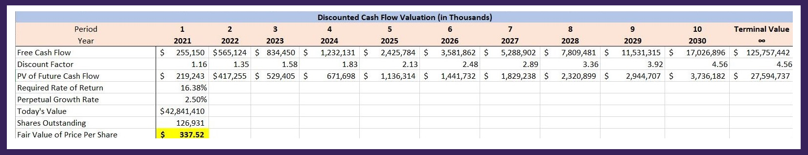

You can download the valuation spreadsheet [here](Spreadsheet/valuation.xlsx). My calculation of the required rate of return was based on the weighted-average cost of capital which is 16.38%. It is used to calculate the discounted cash flow. To find the Free Cash Flow, I used the Yahoo Finance analysts' average revenue assumptions for 2020 and 2021. Then, I assumed that the revenue will grow at an average rate of 48% after 2021. For the amount of active account growth, I assumed that the high acquisition of new active accounts may be stimulated by the ongoing pandemic. As the pandemic ends and the effects fade, other industries such as broadcast televisions and people who work there will go back to work and recover. Therefore, I assumed that the acquisition rate for active accounts will decrease gradually from 40% to an average rate of 10% after 2025. 

Therefore, Roku will have an estimated 250 million active accounts by 2030. The operating margin is based on mature companies in the ad-business which is 20%. Finally, I assumed a 2.5% perpetual growth rate which aligns with the average growth rate of the global economy. My discounted cash flow model valued the company at around 43 billion dollars suggesting the value of the stock at 338 USD per share at the year ended 2020. As of January 25, 2021, Roku stock is priced at 425 USD per share. The stock price is overvalued at the moment. However, holding Roku shares in the long term is the best way to invest in this company since it is still a maturing company that has a large prospect for growth in the global market with large public support for its long term success.   

---
### References for Valuation

* [Form 10-K for the Year Ended December 31, 2019](https://www.sec.gov/ix?doc=/Archives/edgar/data/1428439/000156459020007916/roku-10k_20191231.htm)
* [Form 10-Q for the Quarterly Period ended September 30, 2020](https://www.sec.gov/ix?doc=/Archives/edgar/data/1428439/000156459020051937/roku-10q_20200930.htm)
* [Form 10-Q for the Quarterly Period ended September 30, 2019](https://www.sec.gov/ix?doc=/Archives/edgar/data/1428439/000156459019042335/roku-10q_20190930.htm)
* [Yahoo Finance](https://finance.yahoo.com/quote/ROKU)

### Written By

__Dana K Lain__, Profile: [LinkedIn](https://linkedin.com/in/dana-kyine-lain)
